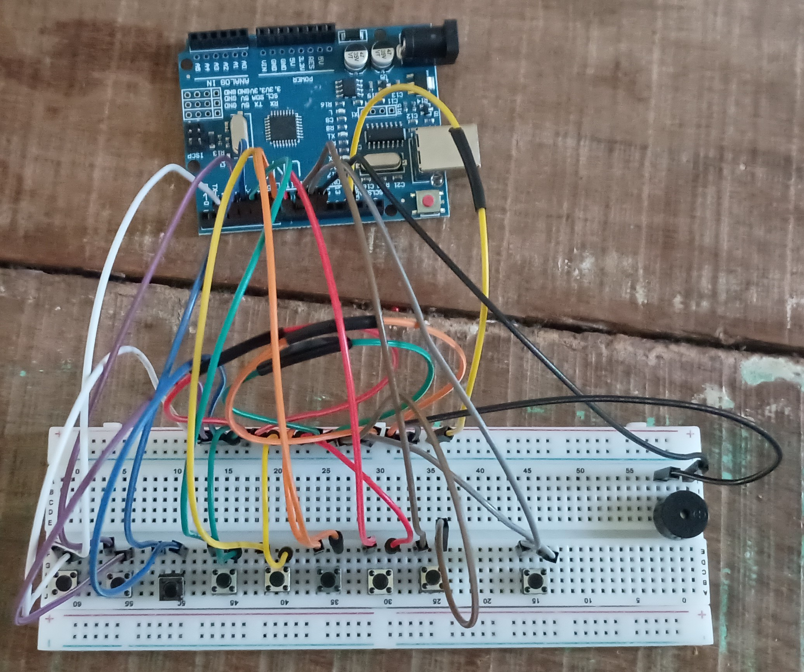

<h1>TECLADO MUSICAL</h1>

Projeto de teclado musical com Arduino na protoboard. Composto por oito botões (teclas) de notas e um botão para trocar o modo de operação. O projeto possui dois modos de operação: 

<ol>
<li>Tocas notas.</li>
<li>Tocar melodias.</li>
</ol>
<h3>TOCAR NOTAS</h3>

Cada um dos oitos botões corresponde a uma nota da escala de dó maior. Quando pressionados os botões correspondentes, o buzzer emitirá a frequência da nota definida. 

<h3>TOCAR MELODIAS</h3>
Quando a função "tocar_melodia" é ativada, o buzzer emitira um trecho musical correspondente ao botão (tecla) pressionado. Serão executados trechos musicais das seguintes músicas:
<ol> 
<li>Tecla 01: Ode à Alegria (Beethoven) </li>
<li>Tecla 02: Jingle Bells </li>
<li>Tecla 03: Cerejeira em Flor (folclore japonês)</li>
<li>Tecla 04: Greensleeves (medieval)</li>
<li>Tecla 05: Serenata Noturna (Mozart)</li>
<li>Tecla 06: Parabéns pra você</li>
<li>Tecla 07: Frère Jacques</li>
<li>Tecla 08: Tico-tico no Fubá (Zequinha de Abreu)</li>
</ol>

